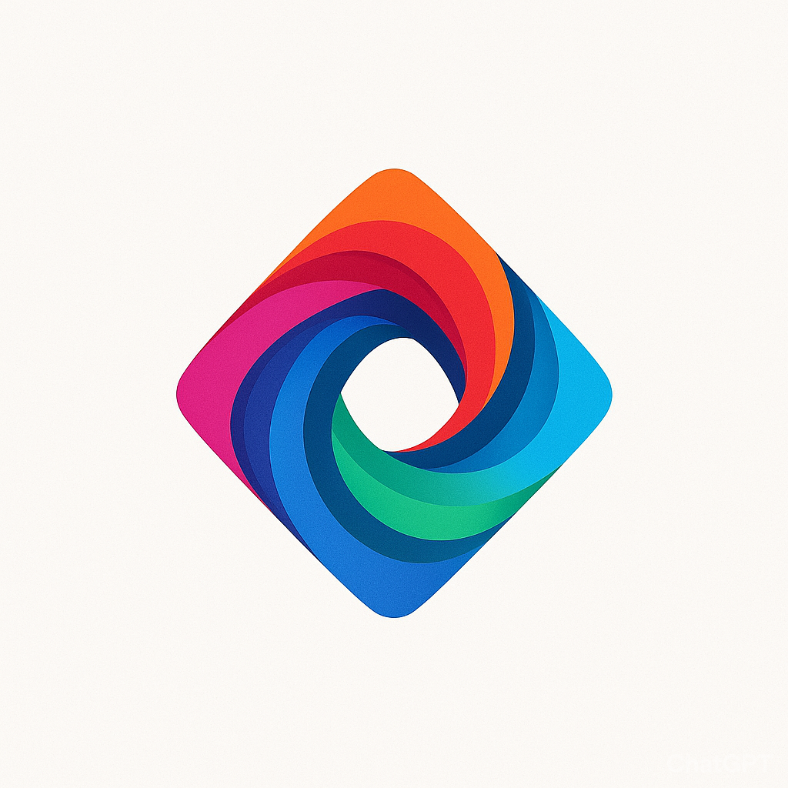
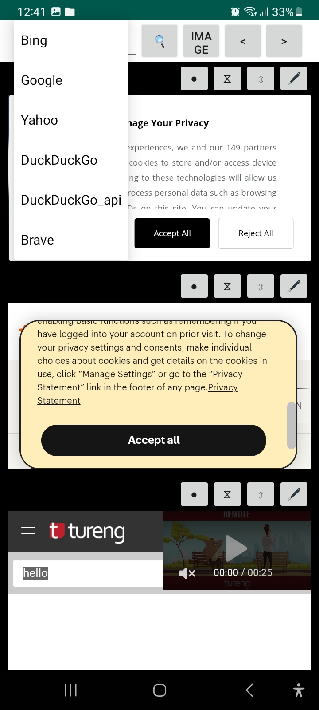
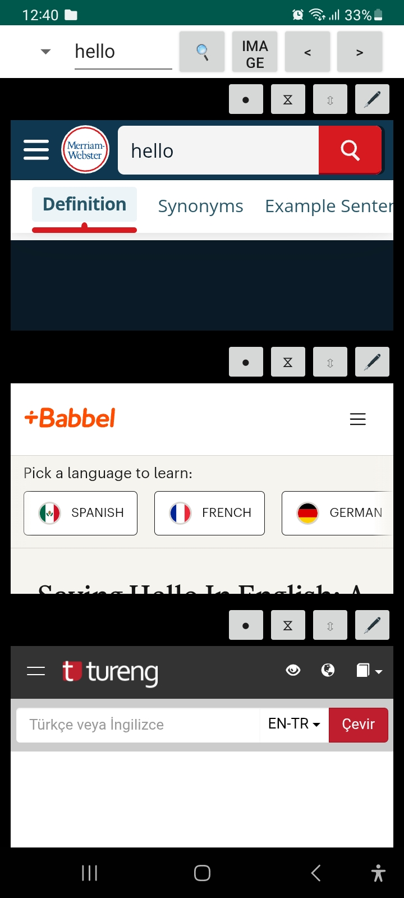
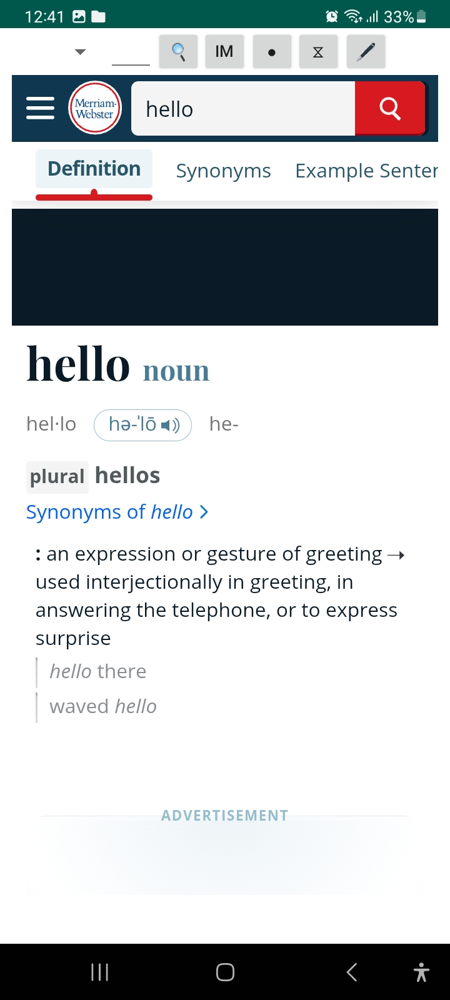
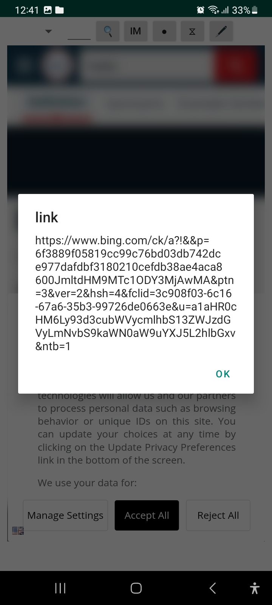

<picture>
  <h1 >Omnexa </h1>

  <source media="(prefers-color-scheme: light)" srcset="/docs/logo_tiny_light.svg">
  

</picture>

I’ve built A search engine entirely in Python3.8 and released it on Google Play Store

<a style="display:inline-block;line-height:18px;margin-top:8px;padding:0;font-size:13px" href="https://play.google.com/store/apps/details?id=briefcase.Omnexa.Omnexa
">
<b>👉 </b> Try 
<b> Omnexa - Web Browser</b> 
on Google Play
</a>

<h3>

[Homepage](https://github.com/devran1/search_engine) 

</h3>

****

screen shots of the app

****
